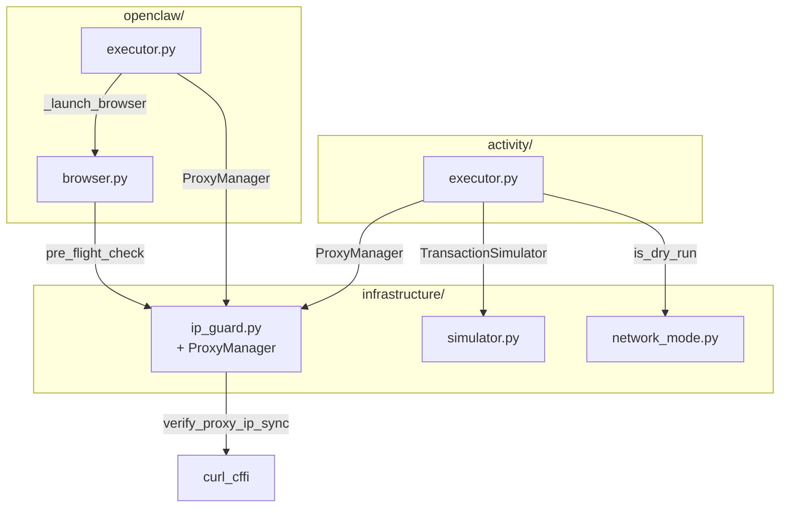

# План устранения дублирования кода

## Анализ зависимостей

### Зависимости файлов:

| Файл | Импортируется в |
|------|-----------------|
| `activity/proxy_manager.py` | `worker/api.py`, `monitoring/health_check.py`, `activity/executor.py` |
| `infrastructure/ip_guard.py` | `activity/executor.py`, `openclaw/browser.py` |
| `infrastructure/simulator.py` | `funding/engine_v3.py`, `withdrawal/orchestrator.py`, `activity/executor.py`, `tests/*.py` |
| `openclaw/browser.py` | `openclaw/executor.py`, `openclaw/tasks/*.py` (6 файлов) |

---

## Решение: Слияние в существующие файлы

### 1. Слить `activity/proxy_manager.py` → `infrastructure/ip_guard.py`

**Обоснование:**
- Оба модуля работают с прокси и IP-проверками
- Дублирование логики валидации прокси
- `infrastructure/` — более подходящее место для инфраструктурного модуля

**Структура `infrastructure/ip_guard.py` после слияния:**

```python
# infrastructure/ip_guard.py

# ============================================================================
# SECTION 1: IP Guard (защита от утечек IP) — БЫЛО
# ============================================================================

SERVER_IPS = {...}  # Список серверных IP

class IPLeakDetected(Exception): ...
class ProxyTTLExpired(Exception): ...

def verify_proxy_ip(...): ...
def verify_proxy_ip_sync(...): ...
async def verify_proxy_ip_async(...): ...
def check_proxy_ttl(...): ...
def pre_flight_check(...): ...

class IPHeartbeatMonitor: ...

# ============================================================================
# SECTION 2: Proxy Manager (управление прокси) — ПЕРЕМЕЩЕНО из proxy_manager.py
# ============================================================================

class ProxyManager:
    """
    Управляет назначением прокси для кошельков.
    
    Использует verify_proxy_ip_sync() из SECTION 1 для валидации.
    """
    
    def __init__(self, db=None, auto_validate=True):
        self.db = db or DatabaseManager()
        self.auto_validate = auto_validate
        self._proxy_cache = {}
        # ... остальной код из proxy_manager.py ...
    
    def _validate_proxy(self, proxy_config: Dict) -> Tuple[bool, Dict]:
        """
        Validate proxy by testing connection.
        
        ИСПОЛЬЗУЕТ verify_proxy_ip_sync() из этого же файла.
        """
        proxy_url = self.build_proxy_url(proxy_config)
        
        try:
            start_time = time.time()
            # ИСПОЛЬЗУЕМ ФУНКЦИЮ ИЗ SECTION 1 (тот же файл)
            current_ip = verify_proxy_ip_sync(
                proxy_url=proxy_url,
                wallet_id=proxy_config.get('proxy_id', 0),
                component='proxy_manager'
            )
            elapsed_ms = int((time.time() - start_time) * 1000)
            
            return True, {
                'response_time_ms': elapsed_ms,
                'detected_ip': current_ip,
                'detected_country': 'unknown'
            }
        except Exception as e:
            return False, {'error': str(e)[:200]}
    
    # ... остальные методы ProxyManager без изменений ...
```

**Обновление импортов:**

```python
# БЫЛО:
from activity.proxy_manager import ProxyManager
from infrastructure.ip_guard import pre_flight_check, verify_proxy_ip_sync

# СТАНЕТ:
from infrastructure.ip_guard import ProxyManager, pre_flight_check, verify_proxy_ip_sync
```

**Удаляемый файл:**
- ❌ `activity/proxy_manager.py` — логика перемещена в `infrastructure/ip_guard.py`

---

### 2. Удалить `DryRunResult` из `activity/executor.py`

**Обоснование:**
- [`DryRunResult`](activity/executor.py:121) — это обёртка над [`SimulationResult`](infrastructure/simulator.py:68)
- Дублирует поля без добавления функционала
- Можно использовать `SimulationResult` напрямую

**Изменения в `activity/executor.py`:**

```python
# УДАЛИТЬ класс DryRunResult (строки 121-143)

# ИЗМЕНИТЬ execute_transaction():
if is_dry_run():
    # Возвращаем dict с данными симуляции напрямую
    return {
        'tx_hash': simulation.simulated_tx_hash,
        'status': 'simulated',
        'gas_used': simulation.estimated_gas,
        'block_number': None,
        'chain': chain,
        'from_address': from_address,
        'to_address': to_address,
        'value_wei': value_wei,
        'nonce': None,
        'confirmed_at': datetime.now(timezone.utc),
        'is_dry_run': True,
        'simulation': simulation
    }
```

---

### 3. Добавить `_launch_browser()` в `openclaw/executor.py`

**Проблема:** В [`openclaw/executor.py:186`](openclaw/executor.py:186) вызывается `self._launch_browser(wallet_id)`, но метод **НЕ СУЩЕСТВУЕТ**.

**Решение:** Добавить метод, делегирующий запуск [`BrowserEngine`](openclaw/browser.py:50):

```python
# openclaw/executor.py - добавить метод

async def _launch_browser(self, wallet_id: int) -> Tuple[Browser, Page]:
    """
    Запускает браузер с anti-detection для кошелька.
    
    Делегирует BrowserEngine из openclaw/browser.py.
    """
    proxy_config = self._get_proxy_config(wallet_id)
    proxy_url = f"{proxy_config['protocol']}://{proxy_config['username']}:{proxy_config['password']}@{proxy_config['host']}:{proxy_config['port']}"
    
    wallet = self.db.execute_query(
        "SELECT address FROM wallets WHERE id = %s",
        (wallet_id,),
        fetch='one'
    )
    
    browser = BrowserEngine(
        proxy_url=proxy_url,
        proxy_provider=proxy_config.get('provider'),
        headless=True,
        stealth_mode=True,
        wallet_address=wallet['address'],
        wallet_id=wallet_id,
        enable_heartbeat=True,
        enable_fingerprint=True
    )
    
    await browser.launch()
    page = await browser.new_page()
    
    return browser, page
```

---

## Сводка изменений

| Действие | Файл | Результат |
|----------|------|-----------|
| ✏️ Изменить | `infrastructure/ip_guard.py` | Добавить класс ProxyManager |
| ❌ Удалить | `activity/proxy_manager.py` | Перемещён в ip_guard.py |
| ✏️ Изменить | `activity/executor.py` | Удалить DryRunResult, обновить импорты |
| ✏️ Изменить | `openclaw/executor.py` | Добавить _launch_browser(), обновить импорты |
| ✏️ Изменить | `worker/api.py` | Обновить импорт ProxyManager |
| ✏️ Изменить | `monitoring/health_check.py` | Обновить импорт ProxyManager |
| ✏️ Изменить | `infrastructure/__init__.py` | Обновить экспорты |

**Итого:** -1 файл (`activity/proxy_manager.py`)

---

## Архитектура после рефакторинга



---

## Уникальная логика сохранена

### ProxyManager (уникальная логика):
- ✅ Кэширование прокси (`_proxy_cache`, `_cache_ttl`)
- ✅ 1:1 wallet-to-proxy mapping
- ✅ Sticky session support
- ✅ Geolocation alignment
- ✅ Health tracking (`last_used_at`)

### IP Guard (уникальная логика):
- ✅ SERVER_IPS — список серверных IP
- ✅ TTL Guard для Decodo (60 min)
- ✅ IPHeartbeatMonitor — фоновый мониторинг
- ✅ pre_flight_check — комплексная проверка

### Интеграция:
- `ProxyManager._validate_proxy()` → использует `verify_proxy_ip_sync()`
- Единый URL для IP-проверки: `https://ifconfig.me`

---

## Риски детекции

### До рефакторинга:
- ❌ Два URL для IP-проверки (`ipinfo.io` + `ifconfig.me`) — паттерн детекции
- ❌ Отсутствие `_launch_browser` — критический баг
- ❌ Дублирование кода увеличивает поверхность атак

### После рефакторинга:
- ✅ Единая точка проверки IP через `verify_proxy_ip_sync()`
- ✅ Единый URL для IP-проверки (`ifconfig.me`)
- ✅ Консистентный запуск браузера через `BrowserEngine`
- ✅ Меньше файлов — меньше точек отказа
