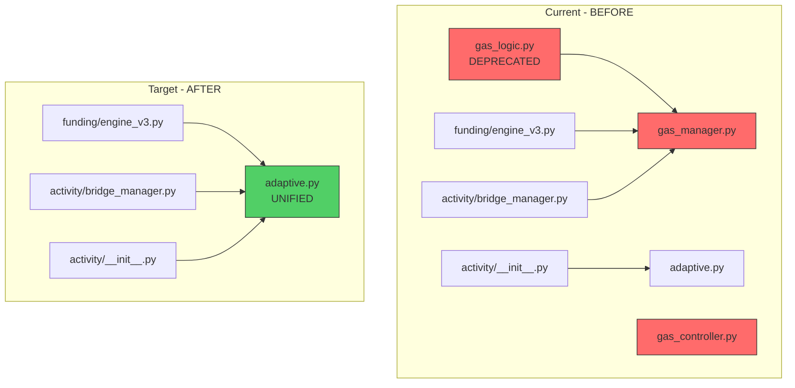
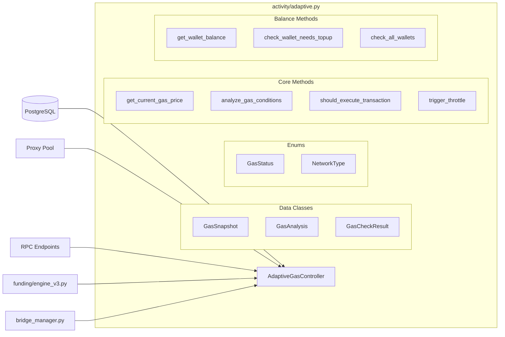

# План слияния газовой логики в adaptive.py

## 📊 Текущее состояние

### 1. [`infrastructure/gas_logic.py`](infrastructure/gas_logic.py) — DEPRECATED (62 lines)
**Статус:** Backward compatibility layer
**Содержимое:**
- Реэкспортирует всё из `gas_manager.py`
- Не содержит собственной логики
- Выдаёт `DeprecationWarning` при импорте

**Импорты:** ❌ Не используется нигде в проекте

---

### 2. [`infrastructure/gas_controller.py`](infrastructure/gas_controller.py) — 258 lines
**Класс:** `GasBalanceController`

**Уникальный функционал:**
| Метод | Описание |
|-------|----------|
| `check_all_wallets()` | Проверка всех кошельков на low balance |
| `trigger_cex_topup_alert()` | Telegram alert для CEX topup |

**Дублируемый функционал:**
| Метод | Дублирует |
|-------|-----------|
| `_get_monitoring_proxy()` | `adaptive.py:150`, `gas_manager.py:229` |
| `get_wallet_balance_eth_equivalent()` | `gas_manager.py:925` |
| `check_wallet_needs_topup()` | `gas_manager.py:991` |

**Импорты:** ❌ Не используется нигде в проекте

---

### 3. [`activity/adaptive.py`](activity/adaptive.py) — 776 lines
**Класс:** `AdaptiveGasController`

**Функционал:**
| Метод | Описание |
|-------|----------|
| `_get_monitoring_proxy()` | Получение LRU proxy |
| `_get_w3_instance()` | Кэширование Web3 инстансов |
| `get_current_gas_price()` | Получение gas price (sync) |
| `analyze_gas_conditions()` | Анализ + рекомендация |
| `should_execute_transaction()` | Решение о выполнении |
| `trigger_throttle()` | Throttling активности |
| `check_sustained_high_gas()` | Проверка длительного high gas |

**Импорты:** ✅ Экспортируется через [`activity/__init__.py`](activity/__init__..py:28)

---

### 4. [`infrastructure/gas_manager.py`](infrastructure/gas_manager.py) — 1159 lines
**Класс:** `GasManager`

**Функционал (async-first):**
| Метод | Описание |
|-------|----------|
| `_get_monitoring_proxy()` | Получение LRU proxy |
| `_fetch_gas_price()` | Async получение gas price |
| `check_gas_viability()` | Проверка жизнеспособности газа |
| `analyze_gas_conditions()` | Анализ условий |
| `should_execute_transaction()` | Решение о выполнении |
| `trigger_throttle()` | Throttling |
| `get_wallet_balance()` | Async получение баланса |
| `check_wallet_needs_topup_async()` | Async проверка topup |

**Импорты:** ✅ Используется в:
- [`funding/engine_v3.py`](funding/engine_v3.py:38)
- [`activity/bridge_manager.py`](activity/bridge_manager.py:58)

---

## 🔍 Диаграмма зависимостей



---

## 📋 План слияния

### Шаг 1: Перенос функционала в `adaptive.py`

**Из `gas_controller.py`:**
- [ ] `check_all_wallets()` → `AdaptiveGasController.check_all_wallets()`
- [ ] `trigger_cex_topup_alert()` → `AdaptiveGasController.trigger_cex_topup_alert()`

**Из `gas_manager.py`:**
- [ ] `NetworkType` enum
- [ ] `NetworkDescriptor` dataclass
- [ ] `GasStatus` enum
- [ ] `GasCheckResult` dataclass
- [ ] `check_gas_viability()` → async версия
- [ ] `_get_24h_moving_average()` → из БД
- [ ] `_calculate_threshold()` → динамический порог
- [ ] `get_wallet_balance()` → async версия
- [ ] `check_wallet_needs_topup_async()` → async проверка

### Шаг 2: Обновление импортов

**Файлы для обновления:**
```python
# funding/engine_v3.py
# БЫЛО:
from infrastructure.gas_manager import GasManager, GasStatus, NetworkType
# СТАНЕТ:
from activity.adaptive import AdaptiveGasController, GasStatus, NetworkType

# activity/bridge_manager.py
# БЫЛО:
from infrastructure.gas_manager import GasManager, GasStatus, GasCheckResult
# СТАНЕТ:
from activity.adaptive import AdaptiveGasController, GasStatus, GasCheckResult
```

### Шаг 3: Обновление `activity/__init__.py`

```python
# Добавить экспорты
from .adaptive import (
    AdaptiveGasController,
    GasStatus,
    GasCheckResult,
    NetworkType,
    NetworkDescriptor,
    GasSnapshot,
    GasAnalysis
)

__all__ = [
    # ... existing exports
    'AdaptiveGasController',
    'GasStatus',
    'GasCheckResult',
    'NetworkType',
    'NetworkDescriptor',
    'GasSnapshot',
    'GasAnalysis'
]
```

### Шаг 4: Удаление файлов

```bash
rm infrastructure/gas_logic.py
rm infrastructure/gas_controller.py
rm infrastructure/gas_manager.py
```

---

## ⚠️ Риски и митигация

| Риск | Митигация |
|------|-----------|
| Breaking changes в импортах | Обновить все импорты в одном коммите |
| Async vs Sync конфликт | Сохранить оба варианта методов |
| Дублирование `_get_monitoring_proxy()` | Оставить одну реализацию |

---

## 📐 Архитектура после слияния



---

## 🎯 Итоговая структура `adaptive.py`

```
activity/adaptive.py (~1200 lines)
├── ENUMS
│   ├── GasStatus
│   └── NetworkType
├── DATA STRUCTURES
│   ├── NetworkDescriptor
│   ├── GasSnapshot
│   ├── GasAnalysis
│   └── GasCheckResult
├── CONFIGURATION
│   ├── TIER_THRESHOLDS
│   ├── GAS_THRESHOLDS_BY_CHAIN
│   └── DEFAULT_MULTIPLIERS
└── AdaptiveGasController
    ├── Proxy Management
    │   └── _get_monitoring_proxy()
    ├── Gas Price Fetching
    │   ├── get_current_gas_price() [sync]
    │   └── _fetch_gas_price() [async]
    ├── Gas Analysis
    │   ├── analyze_gas_conditions()
    │   ├── check_gas_viability() [async]
    │   └── should_execute_transaction()
    ├── Throttling
    │   ├── trigger_throttle()
    │   └── check_sustained_high_gas()
    └── Balance Monitoring
        ├── get_wallet_balance() [async]
        ├── check_wallet_needs_topup()
        ├── check_all_wallets()
        └── trigger_cex_topup_alert()
```

---

## ✅ Критерии готовности

- [ ] Все методы из 3 файлов перенесены в `adaptive.py`
- [ ] Импорты в `engine_v3.py` и `bridge_manager.py` обновлены
- [ ] `activity/__init__.py` экспортирует все нужные классы
- [ ] Файлы `gas_logic.py`, `gas_controller.py`, `gas_manager.py` удалены
- [ ] Тесты проходят (если есть)
