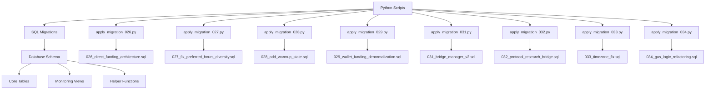

# Карта зависимостей между Python-скриптами и SQL-миграциями

## Обзор

Проект airdrop_v4 использует систему миграций, где Python-скрипты применяют SQL-миграции к базе данных PostgreSQL. Ниже представлена полная карта зависимостей.

## Архитектура миграций

## Детальные зависимости

### 1. Direct Funding Architecture (Migration 026)

**Python-скрипт:** [`apply_migration_026.py`](apply_migration_026.py)  
**SQL-миграция:** [`026_direct_funding_architecture.sql`](database/migrations/026_direct_funding_architecture.sql)

**Зависимости:**
- ❌ **Удаляет:** `intermediate_wallet_1`, `intermediate_wallet_2`, `use_two_hops`, `intermediate_delay_1_hours`, `intermediate_delay_2_hours` из [`funding_chains`](database/schema.sql)
- ✅ **Добавляет:** `direct_cex_withdrawal`, `cex_withdrawal_scheduled_at`, `cex_withdrawal_completed_at`, `cex_txid`, `interleave_round`, `interleave_position` в [`funding_withdrawals`](database/schema.sql)
- ✅ **Создаёт:** `v_direct_funding_schedule` view
- ✅ **Создаёт:** `v_funding_interleave_quality` view
- ✅ **Создаёт:** `v_funding_temporal_distribution` view
- ✅ **Создаёт:** `validate_direct_funding_schedule()` function
- ✅ **Переименовывает:** `intermediate_funding_wallets` → `intermediate_funding_wallets_deprecated_v2`
- ✅ **Переименовывает:** `intermediate_consolidation_wallets` → `intermediate_consolidation_wallets_deprecated_v2`

**Влияние на другие модули:**
- [`activity/executor.py`](activity/executor.py) - использует `v_direct_funding_schedule` view для планирования выводов
- [`funding/engine_v3.py`](funding/engine_v3.py) - использует `direct_cex_withdrawal` колонки для прямых CEX выводов
- [`master_node/jobs.py`](master_node/jobs.py) - использует `validate_direct_funding_schedule()` function для валидации

---

### 2. Preferred Hours Diversity (Migration 027)

**Python-скрипт:** [`apply_migration_027.py`](apply_migration_027.py)  
**SQL-миграция:** [`027_fix_preferred_hours_diversity.sql`](database/migrations/027_fix_preferred_hours_diversity.sql)

**Зависимости:**
- ✅ **Обновляет:** `preferred_hours` в [`wallet_personas`](database/schema.sql) для каждого архетипа
- ✅ **Обновляет:** `skip_week_probability` в [`wallet_personas`](database/schema.sql) по архетипам
- ✅ **Создаёт:** `random_subset_of_hours()` function для генерации случайных подмножеств часов

**Архетипы и диапазоны часов:**
- `ActiveTrader`: 10-14 часов из [8-22]
- `CasualUser`: 5-7 часов из [17-23]
- `WeekendWarrior`: 8-12 часов из [10-21]
- `Ghost`: 6-8 часов из [6,7,8,14,15,20,21,22,23]
- `MorningTrader`: 5-7 часов из [6,7,8,9,10,11,12]
- `NightOwl`: 5-7 часов из [19,20,21,22,23,0,1,2]
- `WeekdayOnly`: 8-12 часов из [9-18]
- `MonthlyActive`: 4-6 часов из [10-16]
- `BridgeMaxi`: 8-12 часов из [8,9,10,11,12,13,14,15,16,17,18,19,20,21,22]
- `DeFiDegen`: 10-14 часов из [7,8,9,10,11,12,13,14,15,16,17,18,19,20,21,22,23]
- `NFTCollector`: 6-9 часов из [12,13,14,15,16,17,18,19,20,21,22,23]
- `Governance`: 4-7 часов из [10,11,12,13,14,15,16,17,18]
- `skip_week_probability` по архетипам:
  - `MonthlyActive`: 0.15 (15% шанс пропустить неделю)
  - `Ghost`: 0.12 (12% шанс пропустить неделю)
  - `WeekdayOnly`: 0.08 (8% шанс пропустить неделю)
  - Остальные: 0.05 (5% шанс пропустить неделю)

**Влияние на другие модули:**
- [`activity/scheduler.py`](activity/scheduler.py) - использует `preferred_hours` для планирования активности
- [`wallets/personas.py`](wallets/personas.py) - генерирует персоны с разнообразными preferred_hours

---

### 3. Wallet Warm-Up State Machine (Migration 028)

**Python-скрипт:** [`apply_migration_028.py`](apply_migration_028.py)  
**SQL-миграция:** [`028_add_warmup_state.sql`](database/migrations/028_add_warmup_state.sql)

**Зависимости:**
- ✅ **Добавляет:** `warmup_status` (VARCHAR(20)) в [`wallets`](database/schema.sql)
- ✅ **Добавляет:** `first_tx_at` (TIMESTAMP) в [`wallets`](database/schema.sql)
- ✅ **Добавляет:** `warmup_completed_at` (TIMESTAMP) в [`wallets`](database/schema.sql)
- ✅ **Создаёт:** `idx_wallets_warmup_status` index
- ✅ **Устанавливает:** существующие кошельки с транзакциями в состояние `active`

**Состояния warmup:**
- `inactive` - кошелёк создан, но ещё не получил funding
- `warming_up` - первая транзакция выполнена, идёт прогрев (3+ TX)
- `active` - прогрев завершён, кошелёк готов к полной активности

**Влияние на другие модули:**
- [`activity/executor.py`](activity/executor.py) - проверяет `warmup_status` перед выполнением транзакций
- [`funding/engine_v3.py`](funding/engine_v3.py) - учитывает `warmup_status` при планировании funding

---

### 4. Wallet Funding Denormalization (Migration 029)

**Python-скрипт:** [`apply_migration_029.py`](apply_migration_029.py)  
**SQL-миграция:** [`029_wallet_funding_denormalization.sql`](database/migrations/029_wallet_funding_denormalization.sql)

**Зависимости:**
- ✅ **Добавляет:** `funding_cex_subaccount_id` (INTEGER) в [`wallets`](database/schema.sql) → [`cex_subaccounts`](database/schema.sql)
- ✅ **Добавляет:** `funding_network` (VARCHAR(50)) в [`wallets`](database/schema.sql)
- ✅ **Добавляет:** `funding_chain_id` (INTEGER) в [`wallets`](database/schema.sql) → [`funding_chains`](database/schema.sql)
- ✅ **Заполняет:** данные из [`funding_withdrawals`](database/schema.sql) → [`funding_chains`](database/schema.sql)
- ✅ **Создаёт:** `v_wallets_funding_info` view

**Распределение по биржам:**
- bybit, kucoin, mexc, okx, binance, gate.io, coinbase, kraken, bitget, bitfinex

**Распределение по сетям:**
- Base, Arbitrum, Polygon, BNB Chain, Optimism, Ink, MegaETH

**Влияние на другие модули:**
- [`funding/engine_v3.py`](funding/engine_v3.py) - использует денормализованные данные для прямых CEX выводов
- [`funding/cex_integration.py`](funding/cex_integration.py) - использует `funding_cex_subaccount_id` для связи с CEX

---

### 5. Bridge Manager v2 (Migration 031)

**Python-скрипт:** [`apply_migration_031.py`](apply_migration_031.py)  
**SQL-миграция:** [`031_bridge_manager_v2.sql`](database/migrations/031_bridge_manager_v2.sql)

**Зависимости:**
- ✅ **Создаёт:** `bridge_history` table
- ✅ **Добавляет:** `bridge_required`, `bridge_from_network`, `bridge_provider`, `bridge_cost_usd`, `bridge_safety_score`, `bridge_available`, `bridge_checked_at`, `bridge_unreachable_reason`, `bridge_recheck_after`, `bridge_recheck_count`, `cex_support` в [`protocol_research_pending`](database/schema.sql)
- ✅ **Создаёт:** `cex_networks_cache` table (24-hour TTL)
- ✅ **Создаёт:** `defillama_bridges_cache` table (6-hour TTL)
- ✅ **Добавляет:** `bridge_required`, `bridge_from_network`, `bridge_provider`, `bridge_cost_usd`, `cex_support` в [`protocols`](database/schema.sql)
- ✅ **Добавляет:** `from_network`, `to_network` в [`scheduled_transactions`](database/schema.sql)
- ✅ **Создаёт:** `depends_on_tx_id` в [`scheduled_transactions`](database/schema.sql)
- ✅ **Создаёт:** `calculate_bridge_safety_score()` function
- ✅ **Создаёт:** `is_bridge_safe()` function
- ✅ **Создаёт:** `get_unreachable_protocols_for_recheck()` function
- ✅ **Создаёт:** `update_protocol_bridge_info()` function
- ✅ **Создаёт:** `auto_reject_stale_unreachable_protocols()` function
- ✅ **Создаёт:** `calculate_final_priority_score()` function
- ✅ **Создаёт:** `get_cex_cached_networks()` function
- ✅ **Создаёт:** `cleanup_expired_cex_cache()` function
- ✅ **Создаёт:** `cleanup_expired_defillama_cache()` function
- ✅ **Создаёт:** `cleanup_all_expired_cache()` function
- ✅ **Создаёт:** `v_recent_bridges` view
- ✅ **Создаёт:** `v_bridge_stats_by_network` view
- ✅ **Создаёт:** `v_protocols_requiring_bridge` view

**Helper Functions:**
- `calculate_bridge_safety_score()` - рассчитывает safety score (0-100) на основе TVL, rank, hacks
- `is_bridge_safe()` - возвращает TRUE если safety score >= 60 (auto-approve threshold)
- `get_unreachable_protocols_for_recheck()` - возвращает протоколы для перепроверки
- `update_protocol_bridge_info()` - обновляет информацию о bridge после перепроверки
- `auto_reject_stale_unreachable_protocols()` - авто-отклоняет протоколы после 4 неудачных попыток

**Cache Tables:**
- `cex_networks_cache` - кэш поддерживаемых сетей CEX (24-hour TTL)
- `defillama_bridges_cache` - кэш мостов DeFiLlama (6-hour TTL)

**Влияние на другие модули:**
- [`research/protocol_analyzer.py`](research/protocol_analyzer.py) - использует `bridge_required`, `bridge_available` колонки
- [`activity/executor.py`](activity/executor.py) - использует bridge_history для выполнения bridge операций
- [`master_node/jobs.py`](master_node/jobs.py) - использует bridge функции для мониторинга

---

### 6. Protocol Research Bridge Integration (Migration 032)

**Python-скрипт:** [`apply_migration_032.py`](apply_migration_032.py)  
**SQL-миграция:** [`032_protocol_research_bridge.sql`](database/migrations/032_protocol_research_bridge.sql)

**Зависимости:**
- ✅ **Добавляет:** `bridge_required`, `bridge_from_network`, `bridge_provider`, `bridge_cost_usd`, `bridge_safety_score`, `bridge_available`, `bridge_checked_at`, `bridge_unreachable_reason`, `bridge_recheck_after`, `bridge_recheck_count`, `cex_support` в [`protocol_research_pending`](database/schema.sql)
- ✅ **Создаёт:** `get_unreachable_protocols_for_recheck()` function
- ✅ **Создаёт:** `update_protocol_bridge_info()` function
- ✅ **Создаёт:** `auto_reject_stale_unreachable_protocols()` function
- ✅ **Создаёт:** `calculate_final_priority_score()` function
- ✅ **Создаёт:** `approve_protocol()` function
- ✅ **Создаёт:** `idx_protocol_bridge_available` index
- ✅ **Создаёт:** `idx_protocol_bridge_required` index
- ✅ **Создаёт:** `idx_protocol_bridge_safety` index

**Влияние на другие модули:**
- [`research/protocol_analyzer.py`](research/protocol_analyzer.py) - использует bridge колонки для интеграции с Bridge Manager
- [`activity/executor.py`](activity/executor.py) - использует bridge функции для планирования bridge операций

---

### 7. Timezone Architecture Fix (Migration 033)

**Python-скрипт:** [`apply_migration_033.py`](apply_migration_033.py)  
**SQL-миграция:** [`033_timezone_fix.sql`](database/migrations/033_timezone_fix.sql)

**Зависимости:**
- ✅ **Добавляет:** `timezone` (VARCHAR(50)) в [`proxy_pool`](database/schema.sql)
- ✅ **Добавляет:** `utc_offset` (INTEGER) в [`proxy_pool`](database/schema.sql)
- ✅ **Обновляет:** NL proxies → `Europe/Amsterdam`, UTC+1
- ✅ **Обновляет:** IS proxies → `Atlantic/Reykjavik`, UTC+0
- ✅ **Обновляет:** CA proxies → `America/Toronto`, UTC-5 (CRITICAL FIX)
- ✅ **Добавляет:** NOT NULL constraints на `timezone` и `utc_offset`
- ✅ **Создаёт:** `idx_proxy_pool_timezone` index

**Timezone Mapping:**
- NL: Europe/Amsterdam, UTC+1
- IS: Atlantic/Reykjavik, UTC+0
- CA: America/Toronto, UTC-5

**Влияние на другие модули:**
- [`activity/scheduler.py`](activity/scheduler.py) - использует `timezone` из [`proxy_pool`](database/schema.sql) для планирования в локальном времени кошелька
- [`wallets/personas.py`](wallets/personas.py) - использует `timezone` для корректного расчёта preferred_hours
- [`infrastructure/ip_guard.py`](infrastructure/ip_guard.py) - использует `timezone` для валидации географии

---

### 8. Gas Logic Refactoring (Migration 034)

**Python-скрипт:** [`apply_migration_034.py`](apply_migration_034.py)  
**SQL-миграция:** [`034_gas_logic_refactoring.sql`](database/migrations/034_gas_logic_refactoring.sql)

**Зависимости:**
- ✅ **Добавляет:** `chain_id` (INTEGER) в [`chain_rpc_endpoints`](database/schema.sql)
- ✅ **Добавляет:** `is_l2` (BOOLEAN) в [`chain_rpc_endpoints`](database/schema.sql)
- ✅ **Добавляет:** `l1_data_fee` (BOOLEAN) в [`chain_rpc_endpoints`](database/schema.sql)
- ✅ **Добавляет:** `network_type` (VARCHAR(20)) в [`chain_rpc_endpoints`](database/schema.sql)
- ✅ **Добавляет:** `gas_multiplier` (DECIMAL(3,1)) в [`chain_rpc_endpoints`](database/schema.sql)
- ✅ **Заполняет:** `chain_id` для известных сетей:
  - Ethereum (1): is_l2=FALSE, l1_data_fee=FALSE, network_type='l1', gas_multiplier=1.5
  - Arbitrum (42161): is_l2=TRUE, l1_data_fee=TRUE, network_type='l2', gas_multiplier=5.0
  - Base (8453): is_l2=TRUE, l1_data_fee=TRUE, network_type='l2', gas_multiplier=5.0
  - Optimism (10): is_l2=TRUE, l1_data_fee=TRUE, network_type='l2', gas_multiplier=5.0
  - Polygon (137): is_l2=FALSE, network_type='sidechain', gas_multiplier=2.0
  - BNB Chain (56): is_l2=FALSE, network_type='sidechain', gas_multiplier=2.0
  - Ink (57073): is_l2=TRUE, l1_data_fee=TRUE, network_type='l2', gas_multiplier=5.0
  - MegaETH (420420): is_l2=TRUE, l1_data_fee=TRUE, network_type='l2', gas_multiplier=5.0
  - zkSync Era (324): is_l2=TRUE, l1_data_fee=TRUE, network_type='l2', gas_multiplier=5.0
  - Scroll (534352): is_l2=TRUE, l1_data_fee=TRUE, network_type='l2', gas_multiplier=5.0
  - Linea (59144): is_l2=TRUE, l1_data_fee=TRUE, network_type='l2', gas_multiplier=5.0
  - Mantle (5000): is_l2=TRUE, l1_data_fee=TRUE, network_type='l2', gas_multiplier=5.0
  - Avalanche (43114): is_l2=FALSE, network_type='sidechain', gas_multiplier=2.0
- ✅ **Создаёт:** `gas_history` table
- ✅ **Создаёт:** `idx_gas_history_chain_time` index
- ✅ **Создаёт:** `idx_gas_history_retention` index
- ✅ **Создаёт:** `idx_chain_rpc_chain_id` index
- ✅ **Добавляет:** `source_chain_gas_ok`, `dest_chain_gas_ok`, `gas_check_at` в [`bridge_history`](database/schema.sql) (если существует)

**Влияние на другие модули:**
- [`activity/executor.py`](activity/executor.py) - использует `gas_multiplier` для расчёта стоимости транзакций
- [`activity/bridge_manager.py`](activity/bridge_manager.py) - использует `gas_history` для отслеживания цен на газ
- [`infrastructure/chain_discovery.py`](infrastructure/chain_discovery.py) - использует `chain_id`, `network_type` для классификации сетей

---

## Кросс-модульные зависимости

### Funding Module
- [`funding/engine_v3.py`](funding/engine_v3.py) зависит от:
  - Migration 026 (direct funding architecture)
  - Migration 029 (funding denormalization)
  - Migration 031 (bridge manager v2)

### Activity Module
- [`activity/executor.py`](activity/executor.py) зависит от:
  - Migration 026 (v_direct_funding_schedule view)
  - Migration 028 (warmup_status)
  - Migration 031 (bridge_history)
  - Migration 034 (gas_history)

### Research Module
- [`research/protocol_analyzer.py`](research/protocol_analyzer.py) зависит от:
  - Migration 031 (bridge columns in protocol_research_pending)
  - Migration 032 (bridge helper functions)

### Infrastructure Module
- [`infrastructure/ip_guard.py`](infrastructure/ip_guard.py) зависит от:
  - Migration 033 (timezone в proxy_pool)

### Wallets Module
- [`wallets/personas.py`](wallets/personas.py) зависит от:
  - Migration 027 (preferred_hours в wallet_personas)
  - Migration 028 (warmup_status в wallets)
  - Migration 029 (funding columns в wallets)

---

## Последовательность применения миграций

---

## Резюме

**Всего миграций:** 42 (001-042)
**Python-скриптов применения:** 8 (026-034)
**Последняя миграция:** 042_proxy_validation_columns.sql

**Ключевые модули:**
- Funding: [`funding/engine_v3.py`](funding/engine_v3.py), [`funding/cex_integration.py`](funding/cex_integration.py)
- Activity: [`activity/executor.py`](activity/executor.py), [`activity/scheduler.py`](activity/scheduler.py), [`activity/bridge_manager.py`](activity/bridge_manager.py)
- Research: [`research/protocol_analyzer.py`](research/protocol_analyzer.py)
- Infrastructure: [`infrastructure/ip_guard.py`](infrastructure/ip_guard.py)
- Wallets: [`wallets/personas.py`](wallets/personas.py), [`wallets/generator.py`](wallets/generator.py)

**Архитектурные паттерны:**
- ✅ Разделение ответственности: Python-скрипты применяют SQL, SQL модифицирует схему
- ✅ Идемпотентность: каждая миграция может быть откачена через rollback
- ✅ Мониторинг: views и функции для валидации состояния системы
- ✅ Кэширование: cache tables для производительности (CEX networks, DeFiLlama bridges)
- ✅ Валидация: helper functions для проверки бизнес-правил
