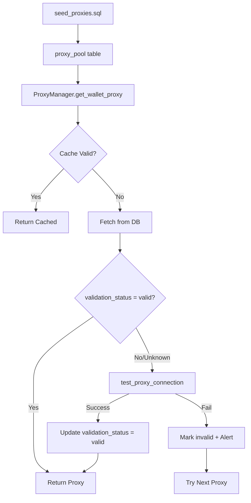

# Proxy Validation Implementation Plan

## Problem Statement

**seed_proxies.sql does NOT validate proxy connectivity.**

The current implementation:
- [`seed_proxies.sql`](../database/seed_proxies.sql) — only INSERT statements, no validation
- [`schema.sql`](../database/schema.sql) — no validation status fields in `proxy_pool` table
- [`proxy_manager.py`](../activity/proxy_manager.py) — has [`test_proxy_connection()`](../activity/proxy_manager.py:388) method but it's never called automatically

## Risk Assessment

| Risk | Level | Impact |
|------|-------|--------|
| Dead proxies in pool | **HIGH** | Wallet assigned to non-working proxy |
| No fallback mechanism | **HIGH** | Transaction hangs on proxy failure |
| No monitoring | **MEDIUM** | Issues discovered only at runtime failure |
| Session expiry not tracked | **MEDIUM** | IPRoyal 7-day / Decodo 60-min TTL not monitored |

## Architecture



## Implementation Plan

### Phase 1: Database Schema Update

**File:** `database/migrations/042_proxy_validation.sql`

```sql
-- Add validation fields to proxy_pool
ALTER TABLE proxy_pool ADD COLUMN validation_status VARCHAR(20) DEFAULT 'unknown';
ALTER TABLE proxy_pool ADD COLUMN last_validated_at TIMESTAMPTZ;
ALTER TABLE proxy_pool ADD COLUMN validation_error TEXT;
ALTER TABLE proxy_pool ADD COLUMN response_time_ms INTEGER;

-- Add index for quick filtering
CREATE INDEX idx_proxy_pool_validation ON proxy_pool(validation_status, is_active);

-- Comments
COMMENT ON COLUMN proxy_pool.validation_status IS 'unknown, valid, invalid, checking';
COMMENT ON COLUMN proxy_pool.last_validated_at IS 'Last successful validation timestamp';
COMMENT ON COLUMN proxy_pool.validation_error IS 'Error message if validation failed';
```

### Phase 2: Validation Script

**File:** `infrastructure/validate_proxies.py`

Key features:
- Validate all proxies in pool
- Concurrent validation with rate limiting
- Update validation_status in database
- Generate report for Telegram alerts
- Support for different providers: IPRoyal, Decodo

### Phase 3: ProxyManager Integration

**File:** `activity/proxy_manager.py`

Modifications:
1. Add `validate_on_fetch=True` parameter to [`get_wallet_proxy()`](../activity/proxy_manager.py:84)
2. Auto-validate if `last_validated_at` is older than 1 hour
3. Fallback to next proxy if current is invalid
4. Update validation status after each use

### Phase 4: Health Check Integration

**File:** `monitoring/health_check.py`

Add periodic proxy validation:
- Run every 6 hours
- Validate random 10% of proxies
- Full validation on Sunday 03:00 UTC
- Alert on Telegram if >10% proxies invalid

## Validation Logic

```python
def validate_proxy(proxy_config: Dict) -> ValidationResult:
    """
    Validate proxy by testing connection to ipinfo.io
    
    Returns:
        ValidationResult with:
        - status: valid/invalid
        - response_time_ms: int
        - error: str or None
        - detected_ip: str
        - detected_country: str
    """
    try:
        start = time.time()
        response = requests.get(
            'https://ipinfo.io/json',
            proxies=build_proxy_dict(proxy_config),
            timeout=10,
            impersonate='chrome110'
        )
        elapsed_ms = int((time.time() - start) * 1000)
        
        if response.status_code == 200:
            data = response.json()
            return ValidationResult(
                status='valid',
                response_time_ms=elapsed_ms,
                detected_ip=data.get('ip'),
                detected_country=data.get('country')
            )
        else:
            return ValidationResult(
                status='invalid',
                error=f'HTTP {response.status_code}'
            )
    except Timeout:
        return ValidationResult(status='invalid', error='timeout')
    except Exception as e:
        return ValidationResult(status='invalid', error=str(e))
```

## Session TTL Tracking

| Provider | TTL | Validation Frequency |
|----------|-----|---------------------|
| IPRoyal | 7 days | Every 24 hours |
| Decodo gate | 60 min | Every 30 minutes |
| Decodo sticky ports | 60 min | Every 30 minutes |

## Files to Create/Modify

| File | Action | Description |
|------|--------|-------------|
| `database/migrations/042_proxy_validation.sql` | CREATE | Migration for validation fields |
| `infrastructure/validate_proxies.py` | CREATE | Standalone validation script |
| `activity/proxy_manager.py` | MODIFY | Add auto-validation |
| `monitoring/health_check.py` | MODIFY | Add periodic validation |
| `check_proxy_pool.py` | MODIFY | Use new validation fields |

## Testing Checklist

- [ ] Run migration 042_proxy_validation.sql
- [ ] Run validate_proxies.py --all
- [ ] Verify validation_status updated in DB
- [ ] Test ProxyManager with invalid proxy
- [ ] Test fallback to next proxy
- [ ] Verify Telegram alerts on validation failures
- [ ] Test session TTL expiry handling

## Rollback Plan

```sql
-- If issues arise, rollback migration
ALTER TABLE proxy_pool DROP COLUMN validation_status;
ALTER TABLE proxy_pool DROP COLUMN last_validated_at;
ALTER TABLE proxy_pool DROP COLUMN validation_error;
ALTER TABLE proxy_pool DROP COLUMN response_time_ms;
DROP INDEX idx_proxy_pool_validation;
```

## Estimated Effort

- Phase 1 (Schema): 15 minutes
- Phase 2 (Script): 1-2 hours
- Phase 3 (Integration): 1 hour
- Phase 4 (Health Check): 30 minutes
- Testing: 30 minutes

**Total: ~3-4 hours**
