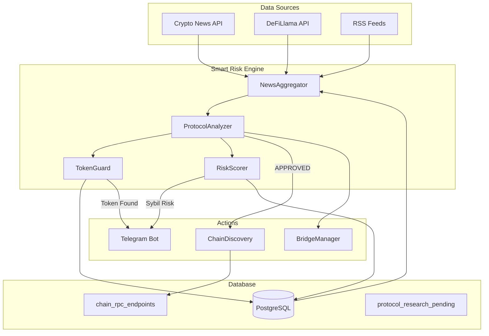
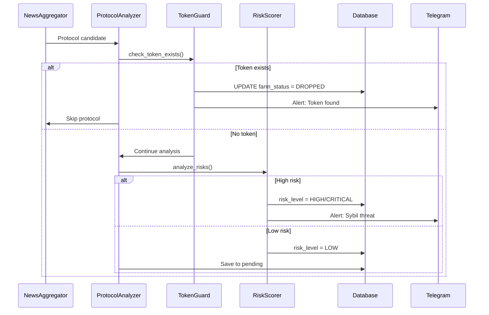

# 🏗️ Smart Risk Engine — Архитектурный План

**Версия:** 1.0  
**Дата:** 2026-03-09  
**Автор:** System Architect  
**Статус:** На утверждении

---

## 📋 Executive Summary

Трансформация `ProtocolAnalyzer` из статического скрипта в **автономный сервис** с:
- Внешней верификацией токенов через API (CoinGecko/DeFiLlama)
- Автоматическим управлением статусом сетей (ACTIVE → DROPPED)
- LLM-анализом Sybil-угроз и KYC-проектов
- Telegram-уведомлениями о критических изменениях

---

## 🎯 Цели и Критерии Приёмки

### Бизнес-цели
1. **Автономность:** Система сама определяет, когда сеть перестала быть целью для фарма
2. **Безопасность:** Автоматическое отсечение Sybil-ловушек до начала работы
3. **Эффективность:** Zero Hardcode — все данные тянуться из БД

### Acceptance Criteria
- [ ] В коде `news_aggregator.py` нет хардкода `l2_chains`
- [ ] Запросы к CoinGecko кэшируются на 24 часа
- [ ] При статусе `DROPPED` отправляется Telegram-алерт
- [ ] LLM находит Sybil-угрозы с точностью > 85%
- [ ] Время отклика TokenGuard < 3 секунд (с кэшем)

---

## 🏛️ Архитектура Системы

### Общая схема



### Компоненты

| Компонент | Файл | Ответственность |
|-----------|------|-----------------|
| **TokenGuard** | `infrastructure/token_guard.py` | Проверка наличия токена через API |
| **RiskScorer** | `research/risk_scorer.py` | LLM-анализ Sybil-угроз |
| **ProtocolAnalyzer** | `research/protocol_analyzer.py` | Оркестрация анализа |
| **NewsAggregator** | `research/news_aggregator.py` | Сбор данных (рефакторинг) |

---

## 📊 Модель Данных

### Расширение `chain_rpc_endpoints` (Migration 036)

```sql
-- Новые поля для автоматизации жизненного цикла
ALTER TABLE chain_rpc_endpoints 
ADD COLUMN IF NOT EXISTS farm_status VARCHAR(20) DEFAULT 'ACTIVE',
ADD COLUMN IF NOT EXISTS token_ticker VARCHAR(20),
ADD COLUMN IF NOT EXISTS last_discovery_check TIMESTAMPTZ;

-- Индекс для быстрой фильтрации активных сетей
CREATE INDEX idx_chain_farm_status 
ON chain_rpc_endpoints(farm_status) 
WHERE farm_status IN ('ACTIVE', 'TARGET');
```

### Статусы `farm_status`

| Статус | Описание | Действие системы |
|--------|----------|------------------|
| `ACTIVE` | Активная сеть для фарма | Обычная работа |
| `TARGET` | Приоритетная сеть 2026 | Увеличенный frequency |
| `DROPPED` | Токен уже выпущен | Прекратить фарм, алерт |
| `MANUAL` | Требует ручного анализа | Алерт, пауза |
| `BLACKLISTED` | Небезопасная сеть | Полный запрет |

### Расширение `protocol_research_pending`

```sql
-- Поля для RiskScorer (уже в миграции 036)
ALTER TABLE protocol_research_pending 
ADD COLUMN IF NOT EXISTS risk_tags TEXT[],
ADD COLUMN IF NOT EXISTS risk_level VARCHAR(20) DEFAULT 'LOW',
ADD COLUMN IF NOT EXISTS requires_manual BOOLEAN DEFAULT FALSE;
```

---

## 🔧 Модуль TokenGuard

### Назначение
Проверка факта выпуска токена проекта через внешние API.

### API Endpoints

| API | Endpoint | Rate Limit | Cost |
|-----|----------|------------|------|
| CoinGecko | `/coins/markets` | 10-50 req/min | Free |
| DeFiLlama | `/protocols` | No limit | Free |

### Логика работы

```python
class TokenGuard:
    async def check_token_exists(self, protocol_name: str) -> TokenCheckResult:
        """
        Проверяет наличие токена у протокола.
        
        Returns:
            TokenCheckResult(
                has_token: bool,
                ticker: Optional[str],
                market_cap: Optional[float],
                source: str
            )
        """
        # 1. Проверка кэша (24 часа)
        cached = self._check_cache(protocol_name)
        if cached:
            return cached
        
        # 2. Запрос к CoinGecko
        result = await self._query_coingecko(protocol_name)
        
        # 3. Если не найден — DeFiLlama
        if not result:
            result = await self._query_defillama(protocol_name)
        
        # 4. Кэширование результата
        self._cache_result(protocol_name, result)
        
        return result
```

### Интеграция с ChainDiscovery

```python
# В ChainDiscoveryService.discover_and_register()
token_check = await token_guard.check_token_exists(network_name)
if token_check.has_token:
    # Автоматически ставим DROPPED
    farm_status = 'DROPPED'
    token_ticker = token_check.ticker
    # Отправляем Telegram алерт
    await telegram_bot.send_dropped_alert(network_name, token_ticker)
```

### Кэширование

```python
# Таблица token_check_cache
CREATE TABLE token_check_cache (
    protocol_name VARCHAR(100) PRIMARY KEY,
    has_token BOOLEAN NOT NULL,
    ticker VARCHAR(20),
    market_cap_usd NUMERIC,
    checked_at TIMESTAMPTZ NOT NULL,
    source VARCHAR(20) NOT NULL
);

-- Автоочистка записей старше 24 часов
SELECT cron.schedule(
    'cleanup_token_cache',
    '0 */6 * * *',
    $$DELETE FROM token_check_cache WHERE checked_at < NOW() - INTERVAL '24 hours'$$
);
```

---

## 🧠 Модуль RiskScorer

### Назначение
LLM-анализ описания протокола для выявления Sybil-угроз и KYC-требований.

### Категории рисков

| Категория | Теги | Действие |
|-----------|------|----------|
| **Sybil Defense** | `SYBIL`, `SNAPSHOT`, `PASSPORT` | `MANUAL` статус |
| **KYC Required** | `KYC`, `IDENTITY` | `BLACKLISTED` статус |
| **High Capital** | `HIGH_CAPITAL` | Только для Tier A |
| **Social Actions** | `SOCIAL`, `TWITTER`, `DISCORD` | `MANUAL` статус |
| **Derivatives** | `DERIVATIVES`, `OPTIONS`, `PERP` | `BLACKLISTED` статус |

### LLM Prompt Template

```python
RISK_SCORER_PROMPT = """
Проанализируй протокол DeFi на наличие Sybil-угроз и KYC-требований.

**Протокол:** {protocol_name}
**Категория:** {category}
**Описание:** {description}
**Цепочки:** {chains}

**Задачи:**
1. Найди упоминания: Sybil defense, Gitcoin Passport, Proof of Humanity, Snapshot
2. Определи, требует ли протокол KYC или верификацию личности
3. Оцени минимальный капитал для участия
4. Проверь требования к социальным действиям (Twitter, Discord)

**Выходной формат JSON:**
{{
    "risk_level": "LOW|MEDIUM|HIGH|CRITICAL",
    "risk_tags": ["SYBIL", "KYC", ...],
    "requires_manual": true|false,
    "min_capital_usd": 0-10000,
    "reasoning": "Краткое объяснение",
    "recommendation": "APPROVED|MANUAL|BLACKLISTED"
}}
"""
```

### Hardcoded Rules (Бритва Сибила)

```python
class SybilRazor:
    """Автоматические правила блокировки."""
    
    # Паттерны для автоматического MANUAL статуса
    AUTO_MANUAL_PATTERNS = [
        r'gitcoin\s*passport',
        r'proof\s*of\s*humanity',
        r'snapshot\s*voting',
        r'sybil\s*detection',
        r'anti-sybil',
    ]
    
    # Паттерны для автоматического BLACKLISTED статуса
    AUTO_BLACKLIST_PATTERNS = [
        r'kyc\s*required',
        r'identity\s*verification',
        r'perpetual|perp',
        r'options\s*trading',
    ]
    
    # Минимальный депозит для HIGH_CAPITAL
    HIGH_CAPITAL_THRESHOLD = 500  # USD
```

---

## 🔄 Автономный Цикл Работы

### Flowchart



### Псевдокод главного цикла

```python
async def autonomous_analysis_cycle():
    """Главный цикл автономного анализа."""
    
    # 1. Сбор данных
    aggregator = NewsAggregator(db)
    candidates = await aggregator.run_full_aggregation()
    
    # 2. Фильтрация по БД (исключаем уже известные)
    new_candidates = filter_known_protocols(candidates)
    
    # 3. Анализ каждого кандидата
    for candidate in new_candidates:
        
        # 3a. Token Kill-Switch
        token_check = await token_guard.check_token_exists(candidate.name)
        if token_check.has_token:
            await mark_chain_dropped(candidate.chains[0], token_check.ticker)
            await telegram_bot.send_dropped_alert(candidate.name, token_check.ticker)
            continue  # Skip this candidate
        
        # 3b. Risk Scoring
        risk_result = await risk_scorer.analyze(candidate)
        
        if risk_result.recommendation == 'BLACKLISTED':
            await mark_protocol_blacklisted(candidate.name, risk_result.risk_tags)
            await telegram_bot.send_blacklist_alert(candidate.name, risk_result.reasoning)
            continue
        
        if risk_result.recommendation == 'MANUAL':
            await save_for_manual_review(candidate, risk_result)
            await telegram_bot.send_manual_review_alert(candidate.name, risk_result.reasoning)
            continue
        
        # 3c. Bridge Check (существующая логика)
        bridge_info = await check_bridge_availability(candidate.chains[0])
        
        # 3d. Save to pending
        await save_to_pending(candidate, risk_result, bridge_info)
```

---

## 📱 Telegram Уведомления

### Типы алертов

| Тип | Условие | Приоритет |
|-----|---------|-----------|
| `DROPPED` | Обнаружен токен | High |
| `BLACKLISTED` | Sybil/KYC угроза | Critical |
| `MANUAL_REVIEW` | Требует внимания | Medium |
| `NEW_TARGET` | Новая приоритетная сеть | Low |

### Формат сообщений

```
🚨 DROPPED ALERT

Сеть: MegaETH
Токен: $MEGA
Market Cap: $45.2M
Источник: CoinGecko

❌ Бот прекратил фарм в сети MegaETH, так как обнаружен токен $MEGA

⏰ 2026-03-09 18:00 UTC
```

---

## 🔌 Интеграция с Существующими Модулями

### NewsAggregator — Рефакторинг

**Проблема:** Хардкод `l2_chains` в строке 235

```python
# ❌ CURRENT (hardcoded)
l2_chains = {"Base", "Arbitrum", "Optimism", "Polygon", "BNB Chain", ...}
```

**Решение:** Загрузка из БД

```python
# ✅ NEW (dynamic from DB)
async def _load_target_chains(self) -> Set[str]:
    """Загружает целевые сети из БД."""
    query = """
        SELECT DISTINCT chain FROM chain_rpc_endpoints
        WHERE farm_status IN ('ACTIVE', 'TARGET')
    """
    rows = self.db.execute_query(query, fetch='all')
    return {row['chain'] for row in rows}
```

### ProtocolAnalyzer — Интеграция

```python
class ProtocolAnalyzer:
    def __init__(self, ...):
        # Новые зависимости
        self.token_guard = TokenGuard(self.db)
        self.risk_scorer = RiskScorer(self.db)
    
    async def analyze_candidate(self, candidate: Dict) -> Optional[Dict]:
        # 1. Token check (NEW)
        token_check = await self.token_guard.check_token_exists(candidate['name'])
        if token_check.has_token:
            logger.info(f"Skipping {candidate['name']}: token already exists")
            return None
        
        # 2. Risk scoring (NEW)
        risk_result = await self.risk_scorer.analyze(candidate)
        if risk_result.recommendation == 'BLACKLISTED':
            return None
        
        # 3. Existing LLM analysis
        analysis = await self._call_openrouter(...)
        
        # 4. Merge results
        analysis['risk_tags'] = risk_result.risk_tags
        analysis['risk_level'] = risk_result.risk_level
        
        return analysis
```

---

## 📈 Метрики и Мониторинг

### KPI

| Метрика | Target | Измерение |
|---------|--------|-----------|
| Token Detection Accuracy | > 95% | CoinGecko vs Manual |
| Sybil Detection Rate | > 85% | LLM vs Manual Review |
| False Positive Rate | < 10% | Manual Review |
| API Response Time | < 3s | P95 (cached) |
| Cache Hit Rate | > 80% | 24h window |

### Логирование

```python
# Структурированные логи для анализа
logger.info(
    "Token check completed",
    extra={
        "protocol": protocol_name,
        "has_token": result.has_token,
        "ticker": result.ticker,
        "source": result.source,
        "cache_hit": result.from_cache,
        "response_time_ms": elapsed_ms
    }
)
```

---

## 🚀 План Реализации

### Phase 1: Foundation (Миграция + TokenGuard)
1. Расширить миграцию 036 (token_ticker, last_discovery_check)
2. Создать `infrastructure/token_guard.py`
3. Добавить таблицу `token_check_cache`
4. Интегрировать с ChainDiscovery

### Phase 2: Intelligence (RiskScorer)
1. Создать `research/risk_scorer.py`
2. Реализовать LLM prompt для Sybil-детекции
3. Добавить hardcoded rules (SybilRazor)
4. Интегрировать с ProtocolAnalyzer

### Phase 3: Autonomy (Интеграция)
1. Рефакторинг NewsAggregator (убрать хардкод)
2. Обновить ProtocolAnalyzer (оркестрация)
3. Добавить Telegram уведомления
4. Тестирование end-to-end

### Phase 4: Validation
1. Unit тесты для TokenGuard
2. Integration тесты для RiskScorer
3. End-to-end тест автономного цикла
4. Load testing для API rate limits

---

## ⚠️ Риски и Митигация

| Риск | Вероятность | Влияние | Митигация |
|------|-------------|---------|-----------|
| CoinGecko API ban | Medium | High | Кэш 24h, fallback на DeFiLlama |
| LLM галлюцинации | Medium | Medium | Hardcoded rules как fallback |
| False positives | Low | Medium | Manual review для borderline |
| Превышение бюджета LLM | Low | Low | Rate limiting, кэш промптов |

---

## 📚 Ссылки

- [Migration 036](../database/migrations/036_farm_status_risk_scorer.sql)
- [TokenVerifier (existing)](../monitoring/token_verifier.py)
- [ChainDiscovery](../infrastructure/chain_discovery.py)
- [ProtocolAnalyzer](../research/protocol_analyzer.py)
- [NewsAggregator](../research/news_aggregator.py)

---

## ✅ Checklist для Утверждения

- [ ] Архитектура одобрена
- [ ] Миграция 036 утверждена
- [ ] API endpoints подтверждены (CoinGecko/DeFiLlama)
- [ ] LLM prompt для RiskScorer утверждён
- [ ] Telegram формат сообщений одобрен
- [ ] Бюджет на LLM запросы подтверждён (~$5-10/мес)

---

**Следующий шаг:** После утверждения — переход в Code mode для реализации `TokenGuard`.
