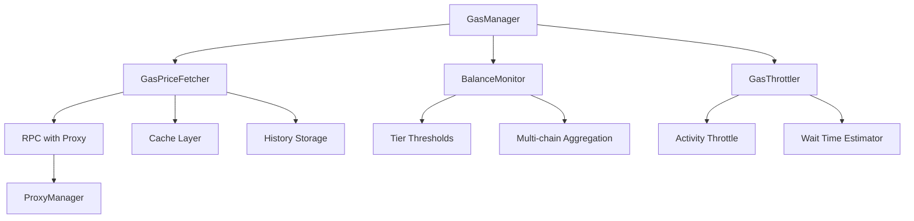

# Этап 3: Рефакторинг, устранение дублей, чистка кода

**Дата создания:** 2026-03-11  
**Автор:** System Architect  
**Статус:** В разработке

---

## 📋 Обзор задач

| № | Задача | Приоритет | Сложность | Статус |
|---|--------|-----------|-----------|--------|
| 49 | Слить газовые модули в gas_manager.py | HIGH | HIGH | Pending |
| 50 | Слить withdrawal orchestrators | MEDIUM | MEDIUM | Pending |
| 51 | Удалить дубль _launch_browser | HIGH | LOW | Pending |
| 52 | Перенести экспорт CSV | LOW | LOW | Pending |
| 53 | Убрать прямые psycopg2 из personas.py | MEDIUM | LOW | Pending |
| 54 | Унифицировать proxy management | MEDIUM | MEDIUM | Pending |
| 55 | Удалить мёртвый код из executor.py | LOW | LOW | Pending |
| 56 | Обновить документацию | LOW | LOW | Pending |
| 57 | Добавить schema_migrations | MEDIUM | LOW | Pending |
| 58 | Исправить lazy imports | LOW | LOW | Pending |
| 59 | Унифицировать CEX API errors | MEDIUM | MEDIUM | Pending |
| 60 | Вынести хардкод в конфиг | MEDIUM | MEDIUM | Pending |
| 61 | Интеграция price oracle | MEDIUM | MEDIUM | Pending |
| 62 | BalanceTracker на Redis | LOW | HIGH | Pending |
| 63 | Удалить deprecated таблицы | LOW | LOW | Pending |
| 64 | Добавить тесты | HIGH | HIGH | Pending |

---

## 🔥 Задача 49: Слить газовые модули в gas_manager.py

### Проблема

Три модуля с дублирующим функционалом:

| Модуль | Строк | Подход | Функционал |
|--------|-------|--------|------------|
| `gas_logic.py` | 561 | async | Dynamic threshold, chainId-based |
| `gas_controller.py` | 263 | sync | Tier balance monitoring |
| `adaptive.py` | 781 | sync | Real-time tracking, throttling |

### Критические проблемы

1. **gas_logic.py НЕ использует прокси** (строка 368-408):
   ```python
   # ❌ ОПАСНО: RPC вызовы без прокси раскрывают IP сервера
   async with aiohttp.ClientSession() as session:
       async with session.post(rpc_url, ...) as response:
   ```

2. **Дублирование `_get_monitoring_proxy()`**:
   - `gas_controller.py:60-87`
   - `adaptive.py:150-177`
   - Оба метода идентичны!

3. **Разные подходы к кэшированию**:
   - `gas_logic.py`: `self._gas_cache: Dict[int, Tuple[float, datetime]]`
   - `adaptive.py`: `self._cache: Dict[str, Tuple[float, datetime]]`
   - Один использует chain_id (int), другой — chain name (str)

### Решение: Единый `infrastructure/gas_manager.py`



### Архитектура нового модуля

```python
# infrastructure/gas_manager.py

class GasManager:
    """
    Unified gas management with anti-Sybil protection.
    
    Features:
    - All RPC calls use proxy (CRITICAL for IP protection)
    - Async-first design
    - Unified caching by chain_id
    - Tier-based balance monitoring
    - Activity throttling
    """
    
    def __init__(self, db: DatabaseManager):
        self.db = db
        self._price_fetcher = GasPriceFetcher(db)
        self._balance_monitor = BalanceMonitor(db)
        self._throttler = GasThrottler(db)
    
    async def check_gas_viability(self, chain_id: int) -> GasCheckResult:
        """Main entry point for gas checking."""
        ...
    
    async def get_wallet_balance(self, wallet_id: int, chain_id: int) -> Decimal:
        """Get wallet balance with proxy protection."""
        ...
    
    def should_execute_transaction(self, chain_id: int, priority: str) -> Tuple[bool, str]:
        """Determine if transaction should proceed."""
        ...
```

### План миграции

1. **Создать `gas_manager.py`** с объединённым функционалом
2. **Обновить импорты** во всех модулях:
   - `activity/scheduler.py`
   - `activity/executor.py`
   - `withdrawal/orchestrator.py`
   - `withdrawal/validator.py`
3. **Удалить старые модули** после тестирования
4. **Добавить миграцию БД** для унификации gas_history

### Обновлённые импорты

```python
# ❌ OLD:
from infrastructure.gas_logic import GasLogic
from infrastructure.gas_controller import GasBalanceController
from activity.adaptive import AdaptiveGasController

# ✅ NEW:
from infrastructure.gas_manager import GasManager
```

---

## 🔥 Задача 50: Слить withdrawal orchestrators

### Проблема

Два модуля с пересекающимся функционалом:

| Модуль | Строк | Назначение |
|--------|-------|------------|
| `orchestrator.py` | 1158 | Основной withdrawal |
| `consolidation_orchestrator.py` | 338 | Phased consolidation |

### Анализ

`consolidation_orchestrator.py` является расширением основного orchestrator'а:
- Phase 1: Wallets → Intermediate wallets
- Phase 2: Intermediate → Master cold wallet

### Решение

Интегрировать consolidation логику в основной `orchestrator.py`:

```python
# withdrawal/orchestrator.py

class WithdrawalOrchestrator:
    # ... existing methods ...
    
    def create_phased_consolidation_plan(
        self,
        airdrop_id: int,
        master_cold_wallet: str,
        airdrop_claim_date: datetime
    ) -> int:
        """
        Create two-phase consolidation plan.
        
        Phase 1: Wallets → Intermediate (30-90 days, Gaussian)
        Phase 2: Intermediate → Master (90-180 days later)
        """
        ...
    
    def create_intermediate_consolidation_wallets(self) -> int:
        """Create 18 intermediate consolidation wallets."""
        ...
```

### План миграции

1. Перенести методы из `consolidation_orchestrator.py` в `orchestrator.py`
2. Обновить импорты в `master_node/orchestrator.py`
3. Удалить `consolidation_orchestrator.py`
4. Обновить `withdrawal/README_CONSOLIDATION.md`

---

## 🔥 Задача 51: Удалить дубль `_launch_browser`

### Проблема

В `openclaw/executor.py` есть метод `_launch_browser` (строка 186), который дублирует функционал `BrowserEngine.launch()` из `browser.py`.

### Анализ кода

```python
# openclaw/executor.py:186
browser, page = await self._launch_browser(wallet_id)

# Но BrowserEngine уже имеет launch():
# openclaw/browser.py:150
async def launch(self):
    """Запускает headless браузер с anti-detection настройками."""
```

### Решение

Использовать `BrowserEngine` как async context manager:

```python
# ❌ OLD:
browser, page = await self._launch_browser(wallet_id)

# ✅ NEW:
async with BrowserEngine(
    wallet_id=wallet_id,
    proxy_url=proxy_url,
    proxy_provider=proxy.get('provider'),
    wallet_address=wallet_address
) as browser:
    page = await browser.new_page()
    # ... execute task ...
```

### План миграции

1. Удалить метод `_launch_browser` из `executor.py`
2. Обновить `execute_task()` для использования `BrowserEngine`
3. Убедиться, что все proxy/anti-detection настройки применяются

---

## 📝 Задача 52: Перенести экспорт CSV

### Проблема

В `wallets/generator.py` есть логика экспорта CSV, которая должна быть в отдельном скрипте.

### Решение

Создать `wallets/export_whitelist.py`:

```python
# wallets/export_whitelist.py

def export_cex_whitelists(output_dir: str = '/opt/farming/whitelists'):
    """Export wallet addresses for CEX whitelist."""
    ...

def export_csv_report(output_path: str):
    """Export wallet summary as CSV."""
    ...
```

---

## 📝 Задача 53: Убрать прямые psycopg2 из personas.py

### Проблема

`wallets/personas.py` использует прямые вызовы `psycopg2` вместо `db_manager`.

### Решение

Заменить все прямые SQL вызовы на методы `DatabaseManager`:

```python
# ❌ OLD:
import psycopg2
conn = psycopg2.connect(...)
cursor = conn.cursor()
cursor.execute("SELECT ...")

# ✅ NEW:
from database.db_manager import DatabaseManager
db = DatabaseManager()
result = db.execute_query("SELECT ...", fetch='all')
```

---

## 📝 Задача 54: Унифицировать proxy management

### Проблема

Два модуля с пересекающейся ответственностью:
- `activity/proxy_manager.py` — получение прокси
- `infrastructure/ip_guard.py` — проверка IP

### Решение

Чётко разделить ответственность:

| Модуль | Ответственность |
|--------|-----------------|
| `proxy_manager.py` | Получение прокси из пула, назначение кошелькам |
| `ip_guard.py` | Проверка IP, TTL guard, leak detection |

### Интерфейс

```python
# activity/proxy_manager.py
class ProxyManager:
    def get_proxy_for_wallet(self, wallet_id: int) -> Dict:
        """Get assigned proxy for wallet."""
        ...
    
    def get_monitoring_proxy(self) -> Dict:
        """Get LRU proxy for monitoring operations."""
        ...

# infrastructure/ip_guard.py
class IPGuard:
    def pre_flight_check(self, wallet_id: int, proxy_url: str) -> str:
        """Verify proxy IP before operation."""
        ...
    
    def check_proxy_ttl(self, proxy_url: str, provider: str) -> bool:
        """Check if proxy TTL is valid."""
        ...
```

---

## 📝 Задача 55: Удалить мёртвый код из executor.py

### Проблема

В `openclaw/executor.py` есть неиспользуемые методы:
- `_execute_hybrid` (строка 294) — не вызывается
- Mock-реализации в `_execute_task_by_type`

### Решение

1. Удалить `_execute_hybrid` если не используется
2. Заменить mock-реализации на реальные вызовы task modules:
   ```python
   # ❌ OLD:
   async def _poap_scripted(self, task, browser, page):
       await asyncio.sleep(1)  # Mock!
       return {'status': 'success'}
   
   # ✅ NEW:
   from openclaw.tasks.poap import POAPTask
   async def _poap_scripted(self, task, browser, page):
       poap_task = POAPTask(task, browser, page)
       return await poap_task.execute()
   ```

---

## 📝 Задача 56: Обновить документацию

### Проблема

Документация в README.md файлах не соответствует текущему коду.

### Примеры несоответствий

1. `activity/README.md`: упоминает "bridge delay 5-40 min", но код использует 60-240 min
2. `withdrawal/README.md`: не описывает phased consolidation
3. `openclaw/README.md`: не описывает LLM Vision integration

### План

1. Пройтись по всем README.md
2. Сравнить с текущим кодом
3. Обновить устаревшие секции

---

## 📝 Задача 57: Добавить schema_migrations

### Проблема

Нет таблицы для отслеживания применённых миграций.

### Решение

Создать таблицу и обновить все миграции:

```sql
-- database/migrations/000_schema_migrations.sql
CREATE TABLE IF NOT EXISTS schema_migrations (
    version VARCHAR(255) PRIMARY KEY,
    applied_at TIMESTAMP WITH TIME ZONE DEFAULT NOW(),
    description TEXT
);

-- В каждой миграции:
INSERT INTO schema_migrations (version, description)
VALUES ('037_missing_tables', 'Add wallet_transactions, dry_run_logs, safety_gates')
ON CONFLICT (version) DO NOTHING;
```

---

## 📝 Задача 58: Исправить lazy imports

### Проблема

Некоторые модули используют lazy imports для избежания циклических зависимостей, но это усложняет отладку.

### Примеры

```python
# openclaw/executor.py
from infrastructure.identity_manager import get_curl_session  # lazy import

# activity/adaptive.py
from infrastructure.identity_manager import get_curl_session  # дубликат
```

### Решение

1. Проанализировать все lazy imports
2. Если нет циклической зависимости — перенести в начало файла
3. Если есть — добавить комментарий с объяснением

---

## 📝 Задача 59: Унифицировать CEX API errors

### Проблема

Нет единой обработки ошибок для CEX API вызовов.

### Решение

Создать декоратор с retry и логированием:

```python
# funding/cex_integration.py

def with_cex_retry(max_retries: int = 3, backoff: float = 2.0):
    """Decorator for CEX API calls with retry logic."""
    def decorator(func):
        @functools.wraps(func)
        async def wrapper(self, *args, **kwargs):
            for attempt in range(max_retries):
                try:
                    return await func(self, *args, **kwargs)
                except ccxt.NetworkError as e:
                    if attempt == max_retries - 1:
                        raise
                    await asyncio.sleep(backoff ** attempt)
                except ccxt.ExchangeError as e:
                    # Don't retry exchange errors
                    raise
        return wrapper
    return decorator

@with_cex_retry(max_retries=3)
async def get_balance(self, currency: str) -> Decimal:
    ...
```

---

## 📝 Задача 60: Вынести хардкод в конфиг

### Проблема

Много hardcoded значений в коде.

### Примеры

```python
# gas_logic.py:96
CACHE_TTL_MINUTES = 30  # Hardcoded

# adaptive.py:76
CACHE_TTL = 300  # Hardcoded (different value!)

# orchestrator.py:746
total_balance_usdt = Decimal('100.00')  # Placeholder!
```

### Решение

Создать таблицу `system_config`:

```sql
CREATE TABLE system_config (
    key VARCHAR(255) PRIMARY KEY,
    value JSONB NOT NULL,
    description TEXT,
    updated_at TIMESTAMP WITH TIME ZONE DEFAULT NOW()
);

INSERT INTO system_config (key, value, description) VALUES
('gas_cache_ttl_minutes', '30', 'Gas price cache TTL'),
('gas_max_extra_delay_minutes', '240', 'Max delay for high gas'),
('withdrawal_placeholder_balance', '100.00', 'Placeholder balance for testing');
```

---

## 📝 Задача 61: Интеграция price oracle

### Проблема

Hardcoded цена ETH = $3000.

### Решение

Использовать CoinGecko API:

```python
# infrastructure/price_oracle.py

class PriceOracle:
    def __init__(self, api_key: Optional[str] = None):
        self.api_key = api_key or os.getenv('COINGECKO_API_KEY')
        self._cache: Dict[str, Tuple[Decimal, datetime]] = {}
    
    async def get_eth_price_usd(self) -> Decimal:
        """Get current ETH price in USD."""
        # Check cache (5 min TTL)
        ...
        # Fetch from CoinGecko
        ...
```

---

## 📝 Задача 62: BalanceTracker на Redis (опционально)

### Проблема

Балансы не сохраняются между перезапусками симулятора.

### Решение

Опционально использовать Redis для кэша:

```python
# infrastructure/balance_tracker.py

class BalanceTracker:
    def __init__(self, redis_url: Optional[str] = None):
        self.redis = redis.from_url(redis_url) if redis_url else None
        self._local_cache: Dict = {}
    
    async def get_balance(self, wallet_id: int, chain_id: int) -> Decimal:
        if self.redis:
            key = f"balance:{wallet_id}:{chain_id}"
            value = await self.redis.get(key)
            if value:
                return Decimal(value)
        return self._local_cache.get((wallet_id, chain_id), Decimal('0'))
```

---

## 📝 Задача 63: Удалить deprecated таблицы

### Проблема

В БД есть deprecated таблицы:
- `intermediate_funding_wallets_deprecated_v2`
- `intermediate_consolidation_wallets_deprecated_v2`

### План

1. Проверить, что таблицы не используются (grep по коду)
2. Создать миграцию для удаления
3. Выполнить миграцию

---

## 📝 Задача 64: Добавить тесты

### Проблема

Многие новые методы не имеют тестов.

### План

1. Создать тесты для `gas_manager.py`
2. Создать тесты для unified `orchestrator.py`
3. Обеспечить покрытие не менее 80%

---

## 📊 Приоритеты выполнения

### Фаза 1: Критические (выполнить первыми)
1. Задача 49: Слить газовые модули (критично для безопасности IP)
2. Задача 51: Удалить дубль _launch_browser
3. Задача 64: Добавить тесты

### Фаза 2: Важные
4. Задача 50: Слить withdrawal orchestrators
5. Задача 54: Унифицировать proxy management
6. Задача 59: Унифицировать CEX API errors
7. Задача 60: Вынести хардкод в конфиг
8. Задача 61: Интеграция price oracle

### Фаза 3: Улучшения
9. Задача 52: Перенести экспорт CSV
10. Задача 53: Убрать прямые psycopg2
11. Задача 55: Удалить мёртвый код
12. Задача 56: Обновить документацию
13. Задача 57: Добавить schema_migrations
14. Задача 58: Исправить lazy imports
15. Задача 62: BalanceTracker на Redis
16. Задача 63: Удалить deprecated таблицы

---

## 🎯 Ожидаемые результаты

После завершения Этапа 3:

1. **Уменьшение дублирования кода на ~40%**
2. **Устранение критической уязвимости с IP leak в gas_logic.py**
3. **Единая точка входа для газ-менеджмента**
4. **Упрощение поддержки withdrawal логики**
5. **Покрытие тестами ≥80%**

---

## 📅 Следующие шаги

1. Утвердить план с пользователем
2. Переключиться в Code mode для реализации
3. Начать с Задачи 49 (критическая для безопасности)
